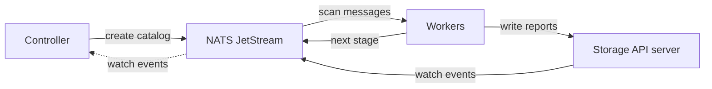

We are happy to announce SBOMscanner
[`v0.13.0`](https://github.com/kubewarden/sbomscanner/releases/tag/v0.13.0)!
The highlight of this release is
[**OpenTelemetry**](https://docs.kubewarden.io/sbom-scanner/0.13/en/user-guide/opentelemetry.html)
support. SBOMscanner now exports traces and metrics for every component,
from the admission webhook down to the SQL statements of the storage layer.
The release also brings plain-HTTP support for insecure registries, better
image discovery for workloads, and a cleaner registry catalog.

## Why telemetry?

A scan in SBOMscanner is a chain of messages over NATS JetStream. The
controller publishes work for the workers, and the workers publish the next
stage to each other: one message per image to generate an SBOM, one per SBOM
to scan it. The results go to the storage API server, which stores them in
PostgreSQL and notifies the other components over NATS.



Every step is asynchronous, and a scan of a large registry spreads over
hundreds of messages and several worker replicas. When a scan is slow or
fails, the logs of five components are a hard place to look for the cause.

With `v0.13.0`, you can follow one scan as one trace, and you can watch the
health of the system with a small set of metrics. All of it uses the
OpenTelemetry standard, so it works with the collector and the backends you
already run.

## One scan, one trace

Each scan produces exactly one trace. The trace starts when the job is
created, by the admission webhook or by the scheduled runner. SBOMscanner
stores the trace context on the job object in the
`sbomscanner.kubewarden.io/traceparent` annotation. From there, the context
travels in the headers of every NATS message, from the controller to the
workers and from worker to worker. It also travels in the HTTP requests to
the storage API server.

The result is a single tree of spans for the whole scan:

- the webhook decision and the reconcile of the `ScanJob`,
- one consumer span per NATS message a worker handles (catalog, SBOM
  generation, vulnerability scan),
- one span per Trivy invocation and per registry call,
- one span per storage operation, down to each SQL query and each NATS
  watch event.

You can also join a scan to your own trace. If your client already carries a
trace, set the `traceparent` annotation on the new `ScanJob`. SBOMscanner
never overwrites it, so the whole scan becomes part of your trace.

Log lines carry the trace ID too. When you find a slow span, you can jump to
the exact log lines that belong to it.

## Metrics for scans and components

Every component exports metrics over OTLP. The most useful ones are:

- **Scan counters**: `sbomscanner.scanjobs` and `sbomscanner.nodescanjobs`
  count finished jobs by result (`complete` or `failed`). Registry scans and
  workload scans are separated by the `source` label.
- **Images scanned**: `sbomscanner.images.scanned` counts scanned images per
  registry host and result.
- **Stage durations**: `worker.scan.duration` is a histogram of each worker
  stage. `worker.trivy.duration` and `worker.registry.call.duration` show
  where the time goes inside a stage.
- **Storage**: `storage.apiserver.request.duration` and `storage.watch.events`
  show the load on the storage layer. The database client and connection
  pool metrics come with them.
- **Runtime**: every replica exports process and Go runtime metrics, so you
  can size the components.



The histograms carry [exemplars](https://opentelemetry.io/docs/specs/otel/metrics/data-model/#exemplars).
An exemplar is one real measurement tagged
with the trace ID that produced it. In a backend that supports exemplars,
you can click a slow point on a latency panel and land in the trace that
caused it.

The full list of spans and metrics, with their attributes and labels, is in
the
[OpenTelemetry reference](https://docs.kubewarden.io/sbom-scanner/0.13/en/reference/opentelemetry-reference.html).

## Getting started

Telemetry export is off by default. To enable it, set the `otel.endpoint`
chart value to the URL of your OTLP/gRPC receiver:

```bash
helm upgrade --install sbomscanner sbomscanner/sbomscanner \
  --namespace sbomscanner \
  --set otel.endpoint=https://otel-collector.telemetry.svc.cluster.local:4317
```

The URL scheme selects the transport security. Use `https://` to enable TLS.
Do not use an `http://` endpoint in production. Plaintext OTLP sends your
telemetry unencrypted over the network.

### Mutual TLS

Two more chart values configure mutual TLS between SBOMscanner and the
collector:

- `otel.caSecretName`: a secret with a `ca.crt` key. SBOMscanner uses it to
  verify the server certificate of the endpoint.
- `otel.clientCertificateSecretName`: a secret with `tls.crt` and `tls.key`
  keys. SBOMscanner presents them as its client certificate.

With [cert-manager](https://cert-manager.io/), one `Certificate` produces a
secret that serves both values, because the secret also contains the CA of
the issuer:

```yaml
apiVersion: cert-manager.io/v1
kind: Certificate
metadata:
  name: sbomscanner-otel-client
  namespace: sbomscanner
spec:
  secretName: sbomscanner-otel-client
  commonName: sbomscanner
  usages:
    - client auth
  issuerRef:
    kind: ClusterIssuer
    name: my-ca-issuer
```

```bash
helm upgrade --install sbomscanner sbomscanner/sbomscanner \
  --namespace sbomscanner \
  --set otel.endpoint=https://otel-collector.telemetry.svc.cluster.local:4317 \
  --set otel.caSecretName=sbomscanner-otel-client \
  --set otel.clientCertificateSecretName=sbomscanner-otel-client
```

The collector must present a server certificate from the same issuer and
require client certificates. For the OpenTelemetry Collector, set
`cert_file`, `key_file`, and `client_ca_file` on the OTLP receiver.

### Histograms

SBOMscanner exports exponential histograms. Prometheus stores them as native
histograms. If your backend does not support them, convert them in the
collector with the
[transform processor](https://github.com/open-telemetry/opentelemetry-collector-contrib/tree/main/processor/transformprocessor):

```yaml
processors:
  transform:
    metric_statements:
      - context: metric
        statements:
          - convert_exponential_histogram_to_histogram("midpoint", [0.05, 0.1, 0.5, 1, 5, 30, 120])
```

### Example dashboard

The repository ships an example Grafana dashboard in
[`examples/dashboards/sbomscanner.json`](https://github.com/kubewarden/sbomscanner/blob/main/examples/dashboards/sbomscanner.json).
It shows the scan counters, the stage durations, the storage metrics, and
the resource usage of each replica. The latency panels have exemplars
enabled, so one click takes you from a data point to its trace.



## Other changes

- **Insecure registries over plain HTTP**: a `Registry` with
  `spec.insecure: true` now also accepts a plain-HTTP connection, not only a
  TLS connection with an untrusted certificate. This is useful for local and
  air-gapped registries.
- **Digest-pinned workload images**: workload scans now discover images that
  a Pod references by digest instead of by tag.
- **Cleaner catalogs**: the registry catalog skips cosign signatures and
  attestations, so they no longer appear as images to scan.
- **NodeScanConfiguration defaults**: a defaulter webhook fills in the
  default values of a `NodeScanConfiguration`, and validation rejects
  invalid attributes at admission time.

## Getting in touch

Give SBOMscanner `v0.13.0` a try and tell us what you see in your traces.
Feedback from real clusters drives the roadmap.

Join the conversation on
[Slack](https://kubernetes.slack.com/?redir=%2Fmessages%2Fkubewarden) or
[GitHub discussions](https://github.com/orgs/kubewarden/discussions).

We would love to hear from you!
